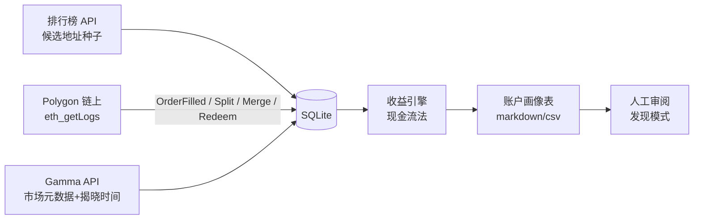

---

name: Polymarket 聪明钱追踪器

overview: 构建一个以链上数据为主、持续运行的 Polymarket 聪明钱追踪与分析工具：用官方排行榜圈定候选地址，从 Polygon 链上重建这些地址的完整交易史，用现金流法计算收益，产出供人工审阅的账户画像表。

todos:

  - id: scaffold

    content: 建项目脚手架：config.yaml、requirements.txt、SQLite schema、README

    status: pending

  - id: seed

    content: 种子模块：排行榜 API 翻页拉候选地址，实测 offset 深度

    status: pending

  - id: markets

    content: 市场元数据模块：Gamma API 映射 condition_id 到市场信息与揭晓时间

    status: pending

  - id: ingest

    content: 链上采集模块：eth_getLogs 分块拉取 OrderFilled/Split/Merge/Redeem，断点续传

    status: pending

  - id: pnl

    content: 收益引擎：现金流法计算盈亏、胜率、建仓时点分析，与官方排行榜交叉校验

    status: pending

  - id: profile

    content: 画像表生成：输出供人工审阅的账户画像 markdown 表

    status: pending

  - id: tracker

    content: 追踪循环：增量同步与定时更新

    status: pending

isProject: false

---

# Polymarket 聪明钱追踪器（MVP）

## 已确认的决策

- 数据以链上为主（[web3.py](http://web3.py) + eth_getLogs 重建），官方 Data API 仅用于圈定候选地址和交叉校验

- 持续运行的追踪器（增量更新），不是一次性脚本

- 候选地址来自官方排行榜 API`data-api.polymarket.com/v1/leaderboard`[，翻页拉取多时间窗口/类别的前](http://data-api.polymarket.com/v1/leaderboard`，翻页拉取多时间窗口/类别的前) N 名）

- RPC 用 Alchemy 免费档（Polygon），key 放 `config.yaml`

- 技术栈 Python，数据落地 SQLite，项目目录 `F:\Blockspace\Polymarket\tracker\`

## 数据流

## 模块与实现要点

### 1. 项目脚手架

`tracker/` 下建 `config.yaml`（RPC、地址数、区块分块大小、轮询间隔）`requirements.txt`（web3、requests、pyyaml）`README.md`、SQLite schema。

### 2. 种子模块（[seed.py](http://seed.py)）

调排行榜 API（limit=50 翻页，OVERALL/CRYPTO 两类 × MONTH/ALL 两窗口），去重后存入 `candidates` 表，记录官方 pnl 用于后续交叉校验。实测 offset 能翻多深，翻不到 1000 就取能拿到的最大值。

### 3. 链上采集模块（[ingest.py](http://ingest.py)）——工程量最大

- 监听合约：CTF Exchange 与 NegRisk CTF Exchange 的 `OrderFilled`（按 maker/taker topic 过滤候选地址）；ConditionalTokens 的 `PositionSplit` / `PositionsMerge` / `PayoutRedemption`

- 分块查询（可配置，默认约 2000 块/次），指数退避重试，断点续传`sync_state` 表记录每地址已同步区块）

- 每条记录保留 `tx_hash / block_number / timestamp / log_index`，主键去重

- 历史回填与增量追踪共用同一套逻辑

### 4. 市场元数据模块（[markets.py](http://markets.py))

用 Gamma API 把链上的 `condition_id / token_id` 映射到市场问题、类别、**揭晓时间**、最终结果；本地缓存。

### 5. 收益引擎（[pnl.py](http://pnl.py)）

- 现金流法`SELL + REDEEM + MERGE - BUY - SPLIT + 持仓市值`

- 区分已实现收益（仅已揭晓市场）与浮盈

- 按地址输出：总盈亏、胜率（仅已结算）、交易次数、平均建仓赔率、平均持仓时长、建仓时点距揭晓的时间分布

- 与官方排行榜 pnl 交叉校验，偏差大的标记出来

### 6. 追踪循环（[tracker.py](http://tracker.py)）

单进程轮询循环：每 N 分钟增量同步新区块 → 更新收益 → 追加日志。MVP 不做告警，先保证数据持续积累。

### 7. 画像表生成（[profile.py](http://profile.py)）

把每个地址的统计 + 近期交易摘要拼成结构化文本，输出 markdown 画像表（地址/行为描述/关键统计/可疑细节/待验证假设），供人工逐行审阅——LLM 聚类分析这一步先在 Cursor 对话里做（把画像表贴给我按 updated_[prompt.md](http://prompt.md) 第 3 条分析），不急着写自动化调用。

## MVP 顺序与砍掉的部分

实现顺序：脚手架 → 种子 → 元数据 → 链上采集（先跑通 1 个地址再扩量）→ 收益引擎 → 画像表 → 追踪循环。

MVP 不做：CEX 资金流向追踪、自动 LLM API 调用、告警推送、Web 界面、"曾经大赚后换地址"的关联分析（报告中注明此局限）。

## 需要你做的事

注册 Alchemy 账号，建一个 Polygon Mainnet app，把 API key 填入 `config.yaml`（我会留好占位符和说明）。